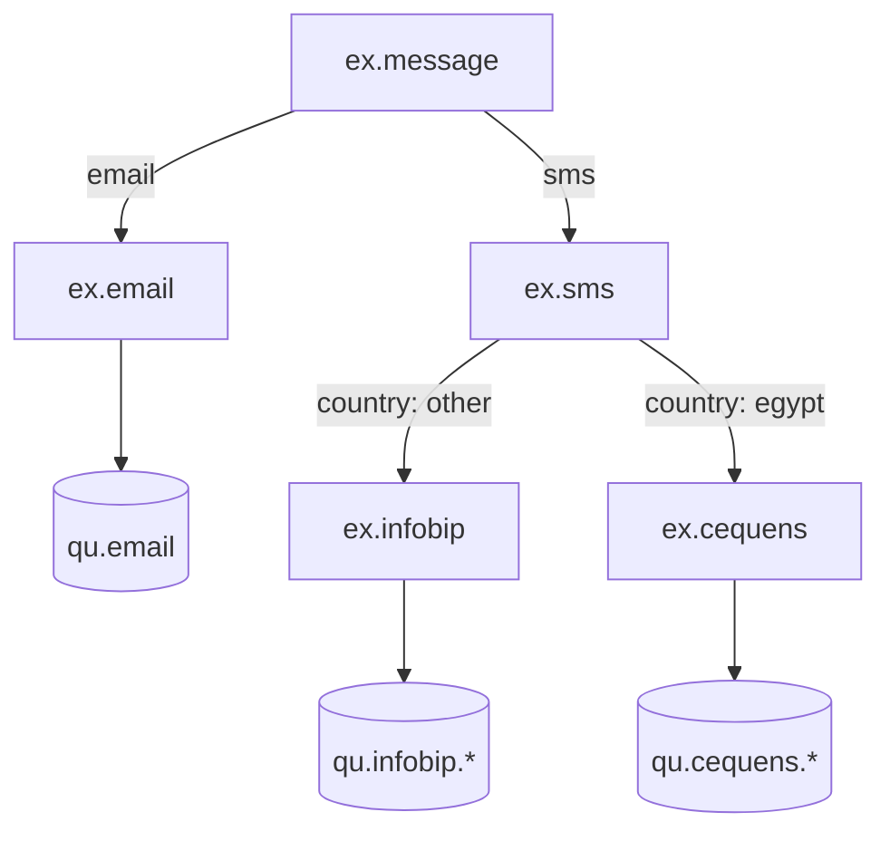
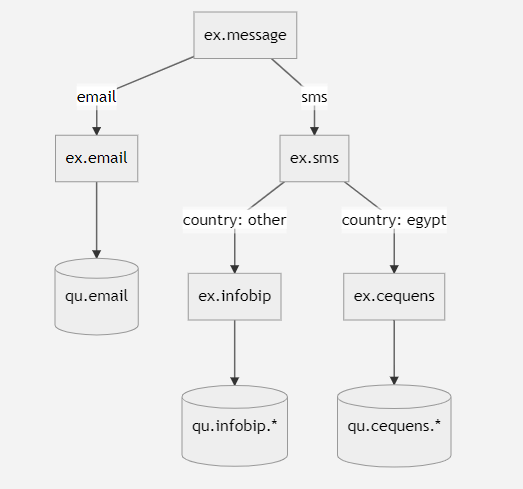

# Welcome to Communication Service!

Communication service is used to send SMS and emails. Currently we support only sending sms via Infobip

## Installation Pre-Requisites

For the project to run locally you need to have following installations

1. Docker (https://docs.docker.com/engine/install/)
2. Docker Compose (https://docs.docker.com/compose/install/)
3. Mongo (https://docs.mongodb.com/manual/installation/)
4. RabbitMQ (https://www.rabbitmq.com/download.html)
5. NodeJS (https://nodejs.org/en/download/)
6. NPM (Gets install with NodeJS)

## Build Project

    npm install

## Build and Run Project with Docker

### Windows

    bootstrap.bat

### Unix

    bootstrap.sh

## Environment Variables

Following environment variables are required to be set if running locally

### Communication
You can also find the environment file at (./apps/communication/.local.env)

    PORT=8080
    HOST=localhost
    MONGO_HOST=mongodb://localhost:27017/comm
    MONGO_PORT=27017
    RABBITMQ_URL=amqp://localhost
    SMS_PROVIDER_AUTH_TYPE=apiKey
    SMS_PROVIDER_BASE_HOST=api.infobip.com
    SMS_PROVIDER_API_KEY=
    SMS_PROVIDER_SENDER_ID=test
    RABBITMQ_SMS_EXCHANGE=ex.sms
    RABBITMQ_SMS_FAILURE_EXCHANGE=ex.sms.failure
    RABBITMQ_SMS_FAILURE_EXCHANGE_ROUTING=error
    RABBITMQ_CEQUENS_EXCHANGE=ex.cequens
    RABBITMQ_INFOBIP_EXCHANGE=ex.infobip
    RABBITMQ_SMS_EXCHANGE_ROUTING=sms
    RABBITMQ_QUEUE_INFOBIP_P1=qu.infobip.p1
    RABBITMQ_QUEUE_INFOBIP_P2=qu.infobip.p2
    RABBITMQ_QUEUE_CEQUENS_P2=qu.cequens.p2
    RABBITMQ_QUEUE_CEQUENS_P1=qu.cequens.p1

    SMS_CEQUENS_BASE_HOST=apis.cequens.com
    SMS_CEQUENS_API_KEY=
    SMS_CEQUENS_USER_NAME=test

# Run Services Locally without Docker

    npm run start:dev

## Exchange Setup for communication!

